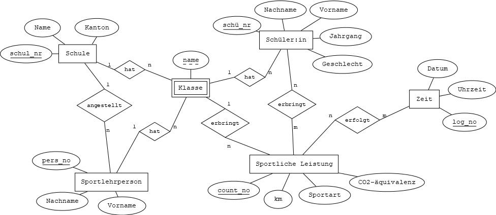

# Datenbanken HS22
## Projekt – milestone 1

### Projektidee
Als Idee soll ein in Realität umsetzbares interkantonales Schulprojekt umgesetzt werden, bei welchem Schüler:innen wie auch Lehrpersonen gemeinsam versuchen, in möglichst kurzer Zeit mit verschiedenen sportlichen Aktivitäten eine Distanz von 42'000 km zu erreichen. Mit dem Projekt «Einmal um die Erde» sollen die Teilnehmenden nicht nur dazu angeregt werden, sich sportlich zu betätigen und somit etwas Gutes für sich wie auch die Umwelt zu tun, nebenbei wird durch die interkantonale Herausforderung auch der Teamgeist der Teilnehmenden gefördert.
Das Projekt "Einmal um die Erde" wird auf einer Webplattform aufbereitet und darüber geregelt. Die zurückgelegten Distanzen der Teilnehmenden (Schüler:innen) werden durch die Sportlehrperson gesammelt, kontrolliert und über die Webplattform in die Datenbank übermittelt. Die Etappen werden auf einem Globus visualisiert. Es entsteht ein virtuelles Wettrennen um die Welt. Als Startpunkt gilt der jeweilige Standort der Schule. Der aktuelle Standort wird stets visuell auf dem Globus dargestellt. Die zurückgelegte Distanz und die entsprechenden Disziplinen wie Laufen, Rad fahren, Schwimmen etc. werden angegeben. Denkbar sind Angaben der verbrauchten Kalorien, gesparten CO2-Emissionen und Gesundheitskosten und vieles mehr. 

Um dieses Projekt umsetzen zu können, braucht es unter anderem eine Datenbank, die im Rahmen dieses Projekts der Vorlesung "Datenbanken" (zumindest theoretisch) realisiert werden soll. 

Für die Datenbank haben wir uns folgende mögliche Entitäten überlegt:
- Schule 
- Sportlehrperson
- Schüler:in
- Klasse (schwache Entität)
- Web-Plattform

--> Braucht es eine Beziehung zw. Webplattform und Sportliche Leistung? 

### Sample Queries (ausformuliert)

1.	Wie viele km hat die Schule XY zum Zeitpunkt X/bisher/Stand der Abfrage erreicht? 
2.	Wie viele km hat die Klasse XY zum Zeitpunkt X/bisher/Stand der Abfrage erreicht? 
3.	Mit welcher Sportart wurde die grösste Distanz zurückgelegt? 
4.	Wie viele Schulen pro Kanton nehmen am Projekt teil? 
5.	Wie viele Klassen pro Schule nehmen am Projekt teil? 
6.	Welches Geschlecht hat mit welcher Sportart am meisten Kilometer zurückgelegt? 
7.	Welche Sportart wurde am häufigsten ausgeübt? 
8.	In welchem Zeitraum (Jahreszeit) wurden die meisten/wenigsten Kilometer zurückgelegt? 
9.	Welche Sportart wurde am meisten/wenigsten von weiblichen/männlichen Teilnehmern ausgeübt? 
10.	Welcher Jahrgang ist beim Projekt am häufigsten/geringsten vertreten? 
11.	Wie viele Teilnehmer:innen sind es insgesamt? 
12.	Wie viele Kilometer wurden insgesamt im Projekt erreicht? 
13.	Welche Schule/Klasse hat in kürzester Zeit die Erde umrundet? 

### ER Diagramm

