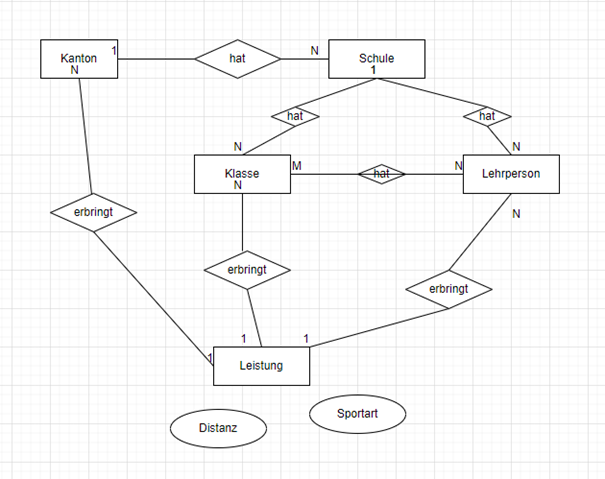

# Datenbanken HS22
## Projekt – milestone 1

### Projektidee:
Als Idee soll ein in Realität umsetzbares interkantonales Schulprojekt umgesetzt werden, bei welchem Schüler:innen wie auch Lehrpersonen gemeinsam versuchen, in möglichst kurzer Zeit mit verschiedenen sportlichen Aktivitäten eine Distanz von 42'000 km zu erreichen. Mit dem Projekt «Einmal um die Erde» sollen die Teilnehmenden nicht nur dazu angeregt werden, sich sportlich zu betätigen und somit etwas Gutes für sich wie auch die Umwelt zu tun, nebenbei wird durch die interkantonale Herausforderung auch der Teamgeist der Teilnehmenden gefördert.
Das Projekt "Einmal um die Erde" wird auf einer Webplattform aufbereitet und darüber geregelt. Die zurückgelegten Distanzen der Teilnehmenden (Schüler: innen) werden gesammelt,
kontrolliert, und in einen Datensatz eingetragen (controlling durch tracking resp. durch
eine Gruppe von Kontrollpersonen). Die Etappen werden auf einem Globus visualisiert. 

Es entsteht ein virtuelles Wettrennen
um die Welt. Starpunkt ist Standort der Schule. Der aktuelle Standort wird jeweils visuell auf
dem Globus dargestellt. Die zurückgelegte Distanz und die entsprechenden Disziplinen wie Laufen, Rad fahren, Schwimmen etc. wird
angegeben. Denkbar sind Angaben der Kalorien, gesparten CO2 Reduktion, gesparten
Gesundheitskosten et.

Um dieses Projekt umsetzen zu können, braucht es unter anderem eine Datenbank, die im Rahmen dieses Projekts der Vorlesung "Datenbanken" (zumindest theoretisch) realisiert werden soll. 

Für die Datenbank haben wir uns folgende mögliche Entities überlegt:
- Schule 
- Lehrperson
- Sportlehrperson (separat?)
- Schüler:in
- Klasse
- Kanton (als Attribut bei der Schule?)
- Plattform

### Sample Queries (ausformuliert):
1.	Wie viele km hat die Schule XY bisher/Stand der Abfrage erreicht? 
2.	Wie viele km hat die Klasse XY bisher/Stand der Abfrage erreicht? 
3.	Wie viele km hat die Lehrperson XY bisher/Stand der Abfrage erreicht? 
4.	Welche Sportart hat am meisten km erzielt? 
5.	Wie viele Schulen pro Kantone nehmen am Projekt teil? 
6.	Wie viele Klassen pro Schule nehmen am Projekt teil? 
7.	Wie viele Lehrpersonen pro Schule nehmen am Projekt teil? 
8.	Wie viele Teilnehmer:innen sind es insgesamt? 
9.	Wie viele km wurden insgesamt im Projekt erreicht? 
10.	Welche Schule/Kanton/Klasse hat in kürzester Zeit die Erde umrundet? 

